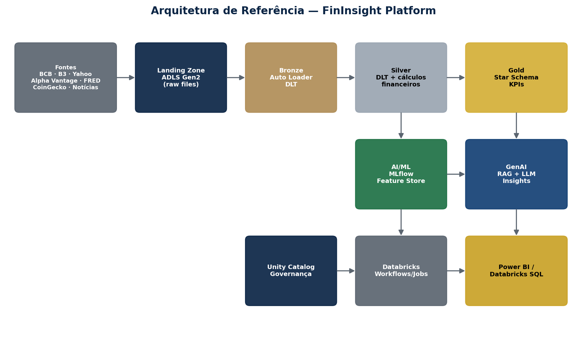
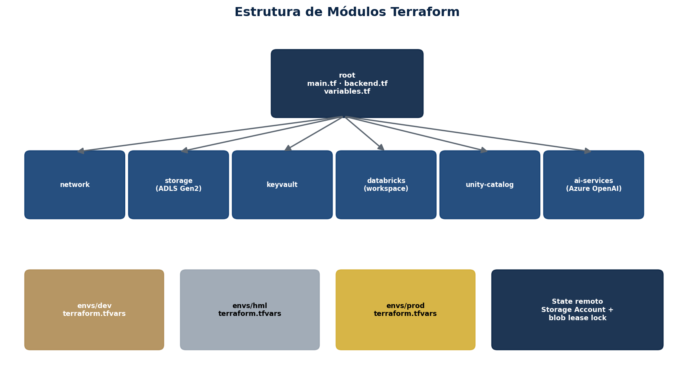
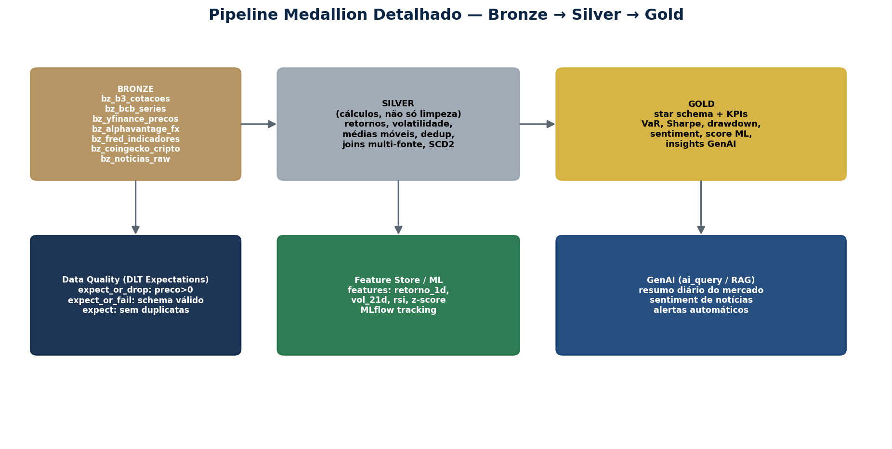
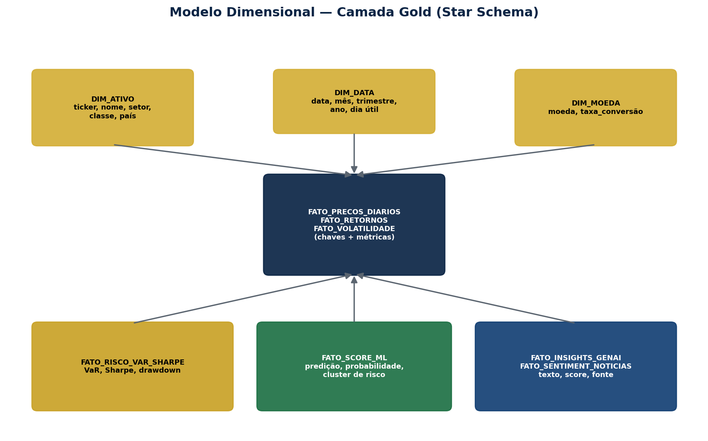

# FinInsight Platform

Financial market data platform on Azure + Databricks — Medallion Architecture (Bronze/Silver/Gold), AI/ML and GenAI, provisioned 100% via Terraform.

> Study project for the **Databricks Certified Data Engineer Associate** certification, focused on real-world data engineering applied to financial markets.

## Table of Contents

- [Overview](#overview)
- [Architecture](#architecture)
- [Repository structure](#repository-structure)
- [Prerequisites](#prerequisites)
- [Provisioning the infrastructure (Terraform)](#provisioning-the-infrastructure-terraform)
- [Verifying in the Azure Portal](#verifying-in-the-azure-portal)
- [Data pipelines](#data-pipelines)
- [Table catalog](#table-catalog)
- [AI/ML](#aiml)
- [GenAI](#genai)
- [CI/CD](#cicd)
- [Environments](#environments)
- [Full documentation](#full-documentation)

## Overview

FinInsight Capital (a fictional company) consolidates free, public financial market data
(BCB, B3, Yahoo Finance, Alpha Vantage, FRED, CoinGecko and news) into a Databricks Lakehouse,
computes risk/return KPIs (VaR, Sharpe, volatility, drawdown), trains predictive models, and
generates automated natural-language insights via GenAI.

## Architecture

```
Sources → Landing (ADLS Gen2) → Bronze (Auto Loader/DLT) → Silver (financial calculations)
        → Gold (star schema + KPIs) → AI/ML (MLflow) + GenAI (RAG/ai_query) → Power BI / Databricks SQL
```



Full details, with diagrams, are in the handbook at `docs/Apostila_FinInsight_Databricks_Azure.pdf`.

## Repository structure

```
fininsight-platform/
├── README.md
├── docs/
│   ├── Apostila_FinInsight_Databricks_Azure.pdf
│   └── diagramas/
│       ├── d_arquitetura.png
│       ├── d_medallion.png
│       ├── d_starschema.png
│       └── d_terraform.png
├── infra/                          # Terraform (IaC)
│   ├── main.tf
│   ├── backend.tf
│   ├── variables.tf
│   ├── outputs.tf
│   ├── envs/
│   │   ├── dev/terraform.tfvars
│   │   ├── hml/terraform.tfvars
│   │   └── prod/terraform.tfvars
│   └── modules/
│       ├── network/
│       ├── storage/                # ADLS Gen2 (landing/bronze/silver/gold)
│       ├── keyvault/
│       ├── databricks/             # Workspace + Access Connector
│       ├── unity-catalog/          # Metastore, Storage Credential, Catalog
│       └── ai-services/            # Azure OpenAI (optional)
├── pipelines/                      # Delta Live Tables / Lakeflow Declarative Pipelines
│   ├── bronze/
│   │   ├── bz_b3_cotacoes.py
│   │   ├── bz_bcb_series.py
│   │   ├── bz_yfinance_precos.py
│   │   ├── bz_alphavantage_fx.py
│   │   ├── bz_fred_indicadores.py
│   │   ├── bz_coingecko_cripto.py
│   │   └── bz_noticias_raw.py
│   ├── silver/
│   │   ├── sv_precos_ativos.py
│   │   ├── sv_retornos_volatilidade.py     # financial calculations (SMA, RSI, z-score)
│   │   ├── sv_precos_com_macro.py          # multi-source join
│   │   ├── sv_indicadores_macro.py
│   │   ├── sv_cambio.py
│   │   ├── sv_cripto.py
│   │   ├── sv_noticias_processadas.py
│   │   └── sv_carteiras_scd2.py            # APPLY CHANGES INTO (SCD2)
│   └── gold/
│       ├── dim_ativo.py
│       ├── dim_data.py
│       ├── dim_moeda.py
│       ├── fato_precos_diarios.py
│       ├── fato_retornos.py
│       ├── fato_volatilidade.py
│       ├── fato_risco_var_sharpe.py        # VaR, Sharpe, Drawdown
│       ├── fato_score_ml.py
│       ├── fato_insights_genai.py
│       └── fato_sentiment_noticias.py
├── notebooks/                       # collection and orchestration jobs
│   ├── 01_coleta_apis.py
│   ├── 02_streaming_producer.py
│   ├── 03_registro_pipeline_dlt.py
│   ├── 05_batch_scoring.py
│   └── 06_genai_insights.py
├── ml/                               # model training and registration (MLflow)
│   ├── previsao_series_temporais.py
│   ├── classificador_risco.py
│   └── clusterizacao_ativos.py
├── genai/
│   ├── vector_search_setup.py
│   └── prompts/
├── databricks.yml                    # Databricks Asset Bundle (Jobs + Pipelines)
├── bitbucket-pipelines.yml            # CI/CD DEV → HML → PROD
└── tests/
    └── test_transformacoes_silver.py
```

## Prerequisites

- Azure account with Owner/Contributor permission on the Resource Group(s)
- Terraform >= 1.7
- Databricks CLI (`databricks bundle` — Asset Bundles)
- Python 3.10+ (for collection jobs and local test notebooks)
- Free API keys: Alpha Vantage (free tier) and, optionally, NewsAPI



## Provisioning the infrastructure (Terraform)

```bash
cd infra
terraform init -backend-config=envs/dev/backend.hcl
terraform validate
terraform plan  -var-file=envs/dev/terraform.tfvars -out=plan.out
terraform apply plan.out
```

Repeat, swapping `dev` for `hml`/`prod` depending on the environment. Never point two
environments at the same Storage Account/catalog.

## Verifying in the Azure Portal

After `apply`, confirm manually (short checklist — full step-by-step in Chapter 13 of the
handbook):

1. Resource Group → 4 containers (landing/bronze/silver/gold) in the Storage Account.
2. Access Connector → Identity → copy the Object ID.
3. IAM on the Storage Account → `Storage Blob/Queue Data Contributor` assigned.
4. IAM on the Resource Group → `EventGrid EventSubscription Contributor` and `Storage Account Contributor`.
5. Databricks Catalog Explorer → External Location → **Test connection** (all green).
6. Catalog Explorer → `fininsight_dev` catalog with the bronze/silver/gold schemas.

(full step-by-step in Chapter 13 of the handbook)

## Data pipelines

Deploy the DLT pipeline via Asset Bundle:

```bash
databricks bundle deploy -t dev
databricks bundle run fininsight_pipeline_diario -t dev
```

The Silver layer performs **full financial calculations** (not just cleaning): logarithmic
return, moving averages (SMA 21d/63d), annualized volatility, 14-day RSI, price z-score, and
multi-source joins (price + FX + macro indicator). See Chapter 25 of the handbook for the
full step-by-step and code.



## Table catalog

23 tables in total: 7 Bronze, 6 Silver, 10 Gold (3 dimensions + 7 facts). Full list and
dimensional model (star schema) in Chapter 30-31 of the handbook.



## AI/ML

- Feature Store with features derived from Silver/Gold (return, volatility, RSI, z-score)
- Models: FX forecasting (Prophet), risk classification (Gradient Boosting), asset
  clustering (KMeans)
- Tracking, Registry and Serving via MLflow

## GenAI

- Daily automated insights via `ai_query` (Databricks Foundation Model API) or Azure OpenAI
- RAG over financial news with Databricks Vector Search
- News summarization and sentiment via `ai_summarize` / `ai_classify`

## CI/CD

Automated per-branch deployment via Bitbucket Pipelines + Databricks Asset Bundles:
`develop` → DEV, `release/*` → HML, `main` → PROD (with mandatory PR review for `main`).

## Environments

| Environment | Unity Catalog catalog | Purpose |
|---|---|---|
| DEV | `fininsight_dev` | Development and testing |
| HML | `fininsight_hml` | Staging / business validation |
| PROD | `fininsight_prod` | Production |

## Full documentation

The detailed step-by-step (infrastructure, pipelines, modeling, AI/ML, GenAI, governance and
troubleshooting) is in **`docs/Apostila_FinInsight_Databricks_Azure.pdf`**, with a clickable
table of contents and bookmarks per chapter.
